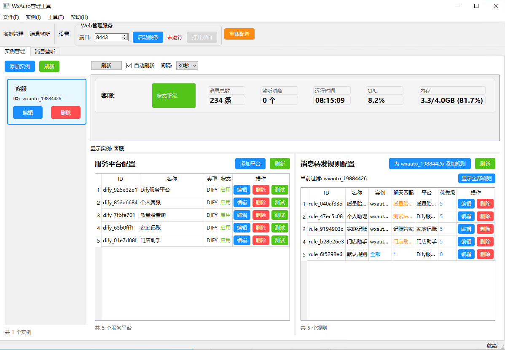
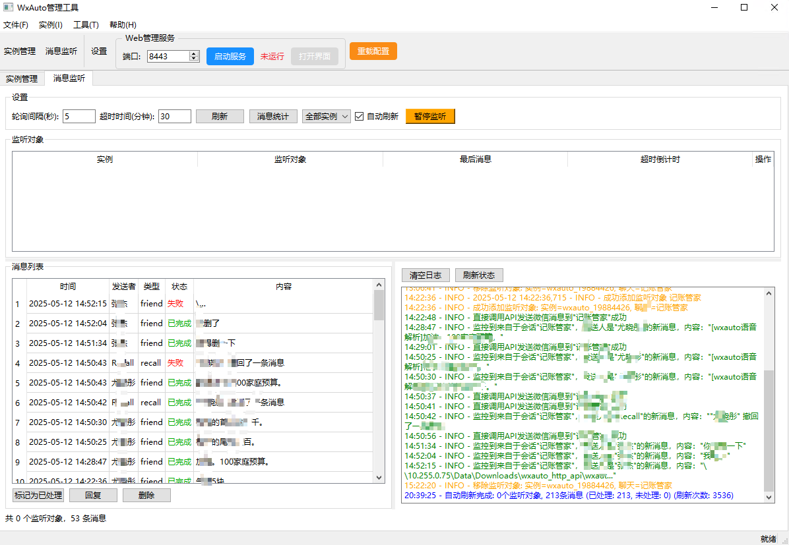

# WxAuto管理工具

<div align="center">


</div>

> 本项目基于wxauto项目做二次开发，致谢：https://github.com/cluic/wxauto

## ⚠️ 重要提示

**本项目无法独立运行，请与wxauto http api项目搭配使用：**
https://github.com/zj591227045/WXAUTO-HTTP-API

## 📝 项目简介

WxAuto管理工具是一个基于Python开发的桌面应用程序，用于管理多个WxAuto实例。它提供了微信状态监控、消息监听与转发、多实例管理等功能，支持对接Dify平台和兼容OpenAI API的服务。

## 🎉 2.0.0 版本重大更新 - 全面革新

> **🚀 这是一个里程碑式的版本更新！** 2.0.0版本带来了前所未有的功能增强和架构优化，为用户提供更加稳定、便捷、功能丰富的微信管理体验。

### 🌟 核心架构升级

- **� 全面增强稳定性**：从底层重构核心架构，大幅提升系统稳定性和可靠性，告别崩溃和卡顿
- **🌐 修复HTTPS访问支持**：彻底解决HTTPS连接问题，确保与各类服务平台的安全通信
- **🧩 服务平台插件化改造**：革命性的插件化架构设计，为下一版本的插件市场奠定坚实基础

### 🌐 全新Web管理体验

- **💻 Web管理页面支持**：全新开发的Web管理界面，支持通过浏览器进行远程管理
- **📱 移动端完整支持**：专为移动设备优化的管理界面，随时随地管理您的微信实例
- **� 移动端微信登录增强**：
  - 支持移动端一键重登微信功能
  - 支持移动端获取登录二维码
  - 无需依赖桌面端即可完成微信登录管理

### 🚀 便捷操作升级

- **🔧 一键启动本机API客户端**：简化部署流程，一键启动配套的WxAuto HTTP API服务
- **➕ 一键添加本机实例**：智能识别本机API服务，自动配置实例连接参数

### 🤖 AI服务平台扩展

- **� 新增扣子(Coze)服务平台支持**：
  - 完整集成扣子平台API
  - 支持工作空间和机器人动态选择
  - 异步对话轮询机制
  - 会话上下文管理
- **💰 新增只为记账平台支持**：
  - 智能记账功能，自动识别消息中的金额信息
  - 多账本支持和管理
  - 自动登录和token刷新机制
  - 记账统计和数据分析
  - 完善的错误处理和重试机制
- **🧩 插件化服务架构**：为未来支持更多AI平台做好准备，插件市场即将推出

### 📡 消息监听服务优化

- **🎯 优化消息监听服务**：提升消息处理效率和准确性
- **👥 支持手动添加长期监听对象**：用户可自定义添加需要长期监听的联系人或群组

### � 功能对比表

| 功能模块 | 1.x版本 | 2.0.0版本 | 提升说明 |
|---------|---------|-----------|----------|
| 系统稳定性 | 基础稳定 | ⭐⭐⭐⭐⭐ 全面增强 | 核心架构重构，稳定性大幅提升 |
| 访问支持 | HTTP | ⭐⭐⭐⭐⭐ HTTP/HTTPS | 完整支持HTTPS安全连接 |
| 管理界面 | 仅桌面端 | ⭐⭐⭐⭐⭐ 桌面+Web+移动端 | 全平台管理支持 |
| 部署便捷性 | 手动配置 | ⭐⭐⭐⭐⭐ 一键操作 | 大幅简化部署和配置流程 |
| AI平台支持 | Dify + OpenAI兼容 | ⭐⭐⭐⭐⭐ + Coze + 只为记账 + 插件化 | 扩展AI服务选择，支持智能记账，插件化架构 |
| 微信登录 | 仅桌面端 | ⭐⭐⭐⭐⭐ 桌面+移动端 | 移动端完整登录支持 |
| 消息监听 | 基础监听 | ⭐⭐⭐⭐⭐ 优化+手动添加 | 监听效率提升，支持自定义对象 |

### 🔮 即将推出

- **🏪 插件市场**：下一版本将推出完整的插件市场，支持第三方插件安装和管理
- **📈 更多AI平台**：基于插件化架构，将持续扩展更多AI服务平台支持

## 📸 软件界面预览

### 主界面

*主界面展示了实例管理、消息监听和服务平台等核心功能的选项卡，支持多实例管理和状态监控。*

### 消息投递规则

*消息投递规则界面允许用户配置消息如何转发到不同的AI服务平台，支持灵活的规则设置和优先级管理。*

## ✨ 功能特点

### 🖥️ 多平台管理
- **🔄 多实例管理**：支持同时管理多个WxAuto实例，统一控制台管理
- **🌐 Web端管理**：全新Web管理界面，支持远程访问和管理
- **� 移动端支持**：完整的移动端管理页面体验，随时随地管理微信实例
- **📲 移动端微信登录**：支持Web管理端一键重登微信、获取登录二维码

### �📊 监控与消息处理
- **📊 状态监控**：实时监控微信实例的状态和性能指标
- **💬 智能消息监听**：优化的消息监听服务，支持手动添加长期监听对象
- **🎯 消息投递规则**：灵活的消息转发规则配置，支持优先级管理
- **🔄 自动重试机制**：消息处理失败时的智能重试和错误恢复

### 🤖 AI服务集成
- **🔌 多平台支持**：支持Dify、OpenAI兼容API、扣子(Coze)、只为记账等多个服务平台
- **💰 智能记账功能**：集成只为记账平台，支持消息自动记账、多账本管理、统计分析
- **🧩 插件化架构**：革命性的插件化设计，支持动态加载和管理服务平台(下个版本)
- **⚙️ 动态配置**：基于平台类型的动态表单生成，简化配置流程
- **🔗 连接测试**：内置连接测试功能，确保服务平台配置正确

### 🛠️ 便捷操作
- **🚀 一键启动**：支持一键启动本机API客户端和添加本机实例
- **⚡ 快速部署**：简化的部署流程，降低使用门槛
- **💾 数据持久化**：使用SQLite存储配置和消息数据，支持数据备份和恢复
- **🔒 安全保障**：HTTPS支持，API密钥加密存储，确保数据安全

## 🚀 源码运行

### 环境要求

- Python 3.11 或更高版本
- PySide6 (Qt for Python)
- aiofiles (异步文件操作)
- 其他依赖见 `requirements.txt`

### 使用Conda安装

```bash
# 创建新的Conda环境
conda create -n wxauto python=3.11
conda activate wxauto

# 安装依赖
pip install -r requirements.txt
```

## 🎮 使用方法

### 启动程序

**首选方式：**
```
# 直接运行打包好的exe文件
wxauto_mgt.exe
```

**开发方式：**
```bash
# 从项目根目录运行
python wxauto_mgt/main.py
```

### 添加微信实例

1. 点击界面中的"添加实例"按钮
2. 填写微信实例的名称、API地址和API密钥
3. 点击"确定"保存实例配置


### 配置服务平台

1. 找到"服务平台"窗口
2. 点击"添加平台"按钮
3. 选择平台类型（Dify或OpenAI）并填写相关配置
4. 设置消息投递规则

### 设置消息转发规则

1. 切换到"消息转发规则"窗口
2. 点击"添加消息转发规则"按钮
3. 选择监听的消息对象以及对应转发的服务平台
4. 开始接收消息

## 🛠️ 开发

### 项目结构

```
wxauto_mgt/
├── core/                    # 核心服务层
│   ├── api_client.py        # WxAuto API客户端
│   ├── message_listener.py  # 消息监听服务
│   ├── message_delivery_service.py  # 消息投递服务
│   ├── service_platform.py # 服务平台接口
│   ├── plugin_manager.py   # 插件管理器 (NEW)
│   └── task_manager.py     # 统一任务管理器 (NEW)
├── data/                   # 数据持久化层
│   ├── database.py         # 数据库操作
│   ├── models.py          # 数据模型
│   └── migrations/        # 数据库迁移脚本
├── ui/                    # 桌面用户界面层
│   ├── components/        # UI组件
│   ├── windows/          # 窗口定义
│   └── dialogs/          # 对话框组件
├── web/                   # Web管理界面 (NEW)
│   ├── static/           # 静态资源
│   ├── templates/        # HTML模板
│   ├── api/             # Web API接口
│   └── mobile/          # 移动端适配 (NEW)
├── plugins/              # 插件系统 (NEW)
│   ├── base/            # 插件基类
│   ├── platforms/       # 服务平台插件
│   │   ├── dify/        # Dify平台插件
│   │   ├── openai/      # OpenAI兼容平台插件
│   │   ├── coze/        # 扣子平台插件 (NEW)
│   │   └── zhiweijz/    # 只为记账平台插件 (NEW)
│   └── marketplace/     # 插件市场 (即将推出)
├── utils/                # 工具类
│   ├── security.py      # 安全工具 (NEW)
│   ├── network.py       # 网络工具 (NEW)
│   └── config.py        # 配置管理
├── docs/                 # 文档
│   ├── plugins/         # 插件开发文档 (NEW)
│   ├── api/            # API文档 (NEW)
│   └── IMG/            # 界面截图
├── tests/               # 测试用例 (NEW)
└── main.py             # 程序入口点
```

### 自定义开发

#### 🧩 插件开发 (推荐)
1. **服务平台插件**：在 `plugins/platforms/` 下创建新的平台插件
2. **插件基类继承**：继承 `plugins/base/` 中的基类实现自定义功能
3. **插件配置**：使用动态表单配置系统，支持自定义字段和验证
4. **插件文档**：参考 `docs/plugins/` 下的开发指南

#### 🔧 核心功能扩展
1. **核心服务扩展**：修改 `core/` 下的模块，注意保持向后兼容性
2. **桌面UI自定义**：修改 `ui/` 下的组件，支持主题和布局自定义
3. **Web界面扩展**：在 `web/` 下添加新的页面和API接口
4. **移动端适配**：在 `web/mobile/` 下优化移动端体验

#### 📊 数据层扩展
1. **数据模型扩展**：修改 `data/models.py` 添加新的数据结构
2. **数据库迁移**：在 `data/migrations/` 下添加迁移脚本
3. **API接口扩展**：在 `web/api/` 下添加新的RESTful接口

#### 🔒 安全和工具
1. **安全功能**：使用 `utils/security.py` 中的加密和验证工具
2. **网络工具**：利用 `utils/network.py` 处理HTTP/HTTPS请求
3. **配置管理**：通过 `utils/config.py` 管理应用配置

## ⚙️ 配置

### 📁 配置文件结构

配置文件位于程序运行目录下的 `data/` 目录中：

```
data/
├── config.json          # 主配置文件
├── database.db          # SQLite数据库
├── plugins_config.json  # 插件配置 (NEW)
├── web_config.json      # Web服务配置 (NEW)
└── security/            # 安全配置目录 (NEW)
    ├── api_keys.enc     # 加密的API密钥
    └── certificates/    # HTTPS证书
```

### 🔧 主要配置项

#### 🖥️ 实例管理配置
- **微信实例配置**：管理多个WxAuto实例连接参数
- **实例状态监控**：健康检查间隔、超时设置
- **自动重连机制**：连接失败时的重试策略

#### 💬 消息处理配置
- **消息监听设置**：轮询间隔、批量处理大小
- **消息投递规则**：转发规则、优先级管理
- **自动重试配置**：失败重试次数、退避策略
- **长期监听对象**：手动添加的监听联系人和群组 (NEW)

#### 🤖 服务平台配置
- **多平台支持**：Dify、OpenAI兼容、扣子(Coze)等平台配置
- **插件化配置**：动态加载的插件参数 (NEW)
- **连接测试设置**：超时时间、重试次数
- **API限流配置**：请求频率限制、并发控制

#### 🌐 Web服务配置 (NEW)
- **Web服务器设置**：端口、HTTPS配置
- **移动端适配**：响应式布局参数
- **API接口配置**：认证、跨域设置
- **静态资源配置**：缓存策略、压缩设置

#### 🔒 安全配置 (NEW)
- **HTTPS支持**：SSL证书配置、安全协议
- **API密钥加密**：密钥存储加密、访问控制
- **访问控制**：IP白名单、用户认证
- **数据安全**：数据库加密、备份策略

## � 鸣谢

感谢以下用户对项目的贡献和支持：

- [@PawNzZi](https://github.com/PawNzZi) - 感谢您的宝贵建议和反馈

## �📄 许可证

[MIT License](LICENSE)

## � 版本历史

### 🎉 v2.0.0 (当前版本) - 全面革新
- ✅ 全面增强系统稳定性
- ✅ 修复HTTPS访问支持
- ✅ 新增Web管理页面
- ✅ 支持移动端管理
- ✅ 一键启动API客户端
- ✅ 新增扣子(Coze)平台支持
- ✅ 新增只为记账平台支持
- ✅ 服务平台插件化改造
- ✅ 优化消息监听服务
- ✅ 支持手动添加长期监听对象

### 📋 v1.x - 基础版本
- ✅ 基础的微信实例管理
- ✅ Dify和OpenAI平台支持
- ✅ 消息监听和转发
- ✅ 桌面端管理界面

## �🔗 相关链接

### 📚 项目相关
- [WxAuto原项目](https://github.com/cluic/wxauto) - 基础微信自动化库
- [WxAuto HTTP API](https://github.com/zj591227045/WXAUTO-HTTP-API) - 配套HTTP API服务
- [项目文档](docs/) - 详细使用文档和开发指南

### 🤖 AI服务平台
- [Dify平台](https://dify.ai) - 开源LLM应用开发平台
- [OpenAI API](https://platform.openai.com/docs/api-reference) - OpenAI官方API文档
- [扣子(Coze)平台](https://www.coze.cn) - 字节跳动AI机器人平台
- [只为记账平台](https://www.zhiweijz.cn) - 智能记账服务平台

### 🛠️ 技术文档
- [PySide6文档](https://doc.qt.io/qtforpython-6/) - Python Qt框架文档
- [FastAPI文档](https://fastapi.tiangolo.com/) - Web API框架文档
- [SQLite文档](https://www.sqlite.org/docs.html) - 数据库文档